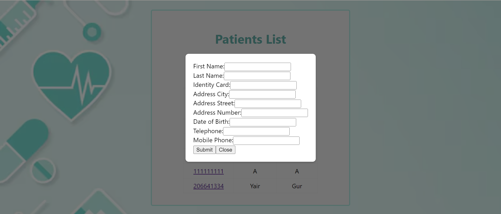
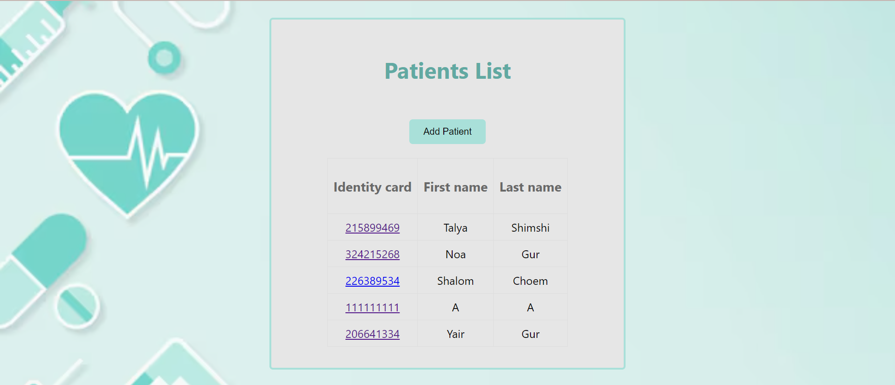
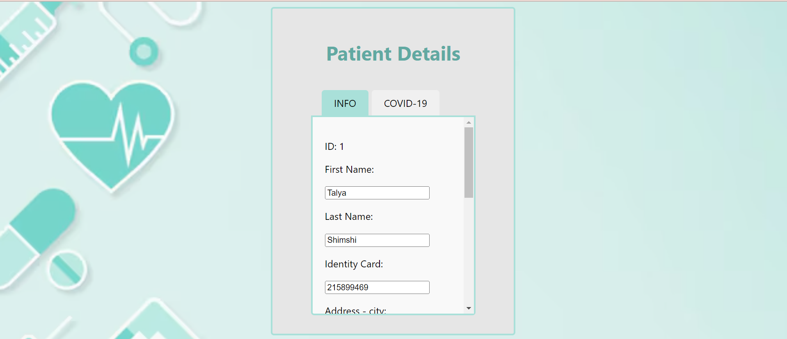
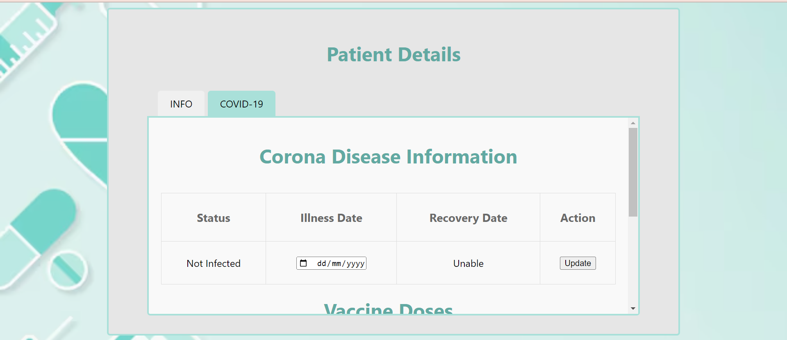
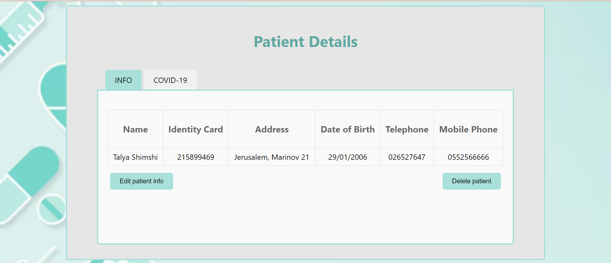
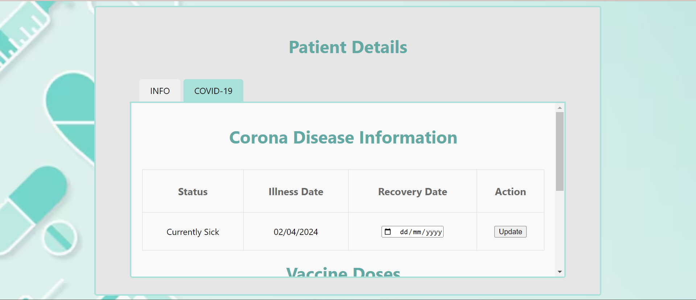
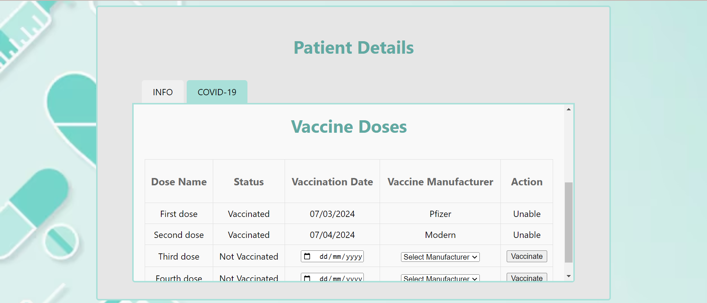

# Hadassim_Ex1 - 

**Installs for client:**

npm install react react-dom

**Installs for server:**

download and install Node.js from the official website: https://nodejs.org/

npm install express

npm install cors

npm install body-parser

"start": "node index.js"

**Installs for DB:**

npm install mysql2

# Hadassim_Ex1 - Twitter towers
https://colab.research.google.com/drive/1h4aMEISMEsshKV6SyHlbiTs4WvzSxPXU?usp=sharing
